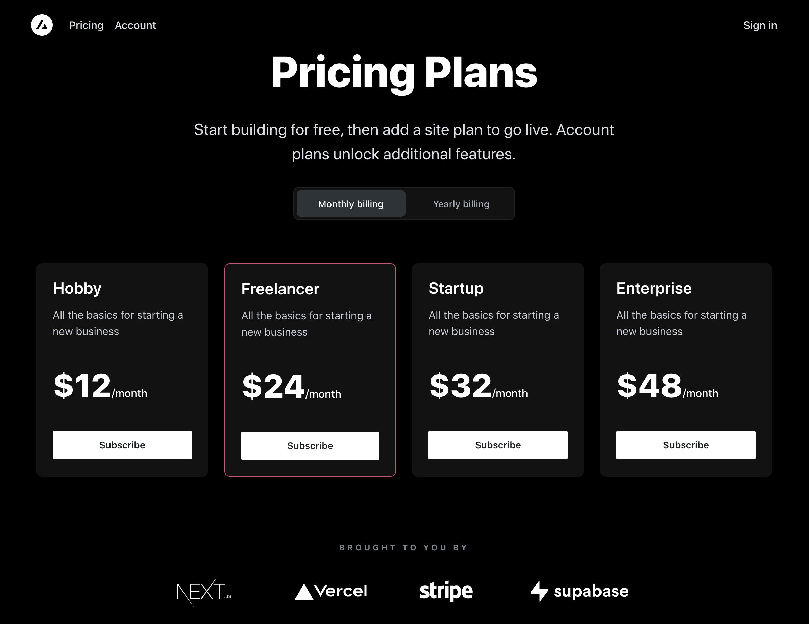

# Next.js Subscription Payments Starter

The all-in-one starter kit for high-performance SaaS applications.

## Features

- Secure user management and authentication with [Supabase](https://supabase.io/docs/guides/auth)
- Powerful data access & management tooling on top of PostgreSQL with [Supabase](https://supabase.io/docs/guides/database)
- Integration with [Stripe Checkout](https://stripe.com/docs/payments/checkout) and the [Stripe customer portal](https://stripe.com/docs/billing/subscriptions/customer-portal)
- Automatic syncing of pricing plans and subscription statuses via [Stripe webhooks](https://stripe.com/docs/webhooks)
- Local development support with Supabase using Docker

## Demo

- [View Demo](https://subscription-payments.vercel.app/)

[](https://subscription-payments.vercel.app/)

## Architecture


## Step-by-Step Setup

### Initiate Deployment

#### Vercel Deploy Button

[](https://vercel.com/new/clone?repository-url=https%3A%2F%2Fgithub.com%2Fvercel%2Fnextjs-subscription-payments&env=NEXT_PUBLIC_STRIPE_PUBLISHABLE_KEY,STRIPE_SECRET_KEY&envDescription=Enter%20your%20Stripe%20API%20keys.&envLink=https%3A%2F%2Fdashboard.stripe.com%2Fapikeys&project-name=nextjs-subscription-payments&repository-name=nextjs-subscription-payments&integration-ids=oac_VqOgBHqhEoFTPzGkPd7L0iH6&external-id=https%3A%2F%2Fgithub.com%2Fvercel%2Fnextjs-subscription-payments%2Ftree%2Fmain)

The Vercel Deployment will create a new repository with this template on your GitHub account and guide you through a new Supabase project creation. The [Supabase Vercel Deploy Integration](https://vercel.com/integrations/supabase) will set up the necessary Supabase environment variables and run the [SQL migrations](./supabase/migrations/20230530034630_init.sql) to set up the Database schema on your account. You can inspect the created tables in your project's [Table editor](https://app.supabase.com/project/_/editor).

Should the automatic setup fail, please [create a Supabase account](https://app.supabase.com/projects), and a new project if needed. In your project, navigate to the [SQL editor](https://app.supabase.com/project/_/sql) and select the "Stripe Subscriptions" starter template from the Quick start section.

### Configure Auth

Follow [this guide](https://supabase.com/docs/guides/auth/social-login/auth-github) to set up an OAuth app with GitHub and configure Supabase to use it as an auth provider.

In your Supabase project, navigate to [auth > URL configuration](https://app.supabase.com/project/_/auth/url-configuration) and set your main production URL (e.g., `https://your-deployment-url.vercel.app`) as the site URL.

Next, in your Vercel deployment settings, add a new **Production** environment variable called `NEXT_PUBLIC_SITE_URL` and set it to the same URL. Make sure to deselect preview and development environments to ensure that preview branches and local development work correctly.

#### [Optional] - Set up Redirect Wildcards for Deploy Previews

If you've deployed this template via the "Deploy to Vercel" button above, you can skip this step. The Supabase Vercel Integration will have set redirect wildcards for you. You can check this by going to your Supabase [auth settings](https://app.supabase.com/project/_/auth/url-configuration) and verifying the list of redirects under "Redirect URLs".

Otherwise, for auth redirects (email confirmations, magic links, OAuth providers) to work correctly in deploy previews, navigate to the [auth settings](https://app.supabase.com/project/_/auth/url-configuration) and add the following wildcard URL to "Redirect URLs": `https://*-username.vercel.app/**`.

### Configure Stripe

Next, configure [Stripe](https://stripe.com/) to handle test payments. If you don't already have a Stripe account, create one now.

For the following steps, ensure you have the ["Test Mode" toggle](https://stripe.com/docs/testing) switched on.

#### Create a Webhook

1. Click the "Add Endpoint" button on the [test Endpoints page](https://dashboard.stripe.com/test/webhooks).
2. Enter your production deployment URL followed by `/api/webhooks` for the endpoint URL (e.g., `https://your-deployment-url.vercel.app/api/webhooks`).
3. Click `Select events` under the `Select events to listen to` heading.
4. Click `Select all events` in the `Select events to send` section.
5. Copy `Signing secret` as we'll need that in the next step (e.g., `whsec_xxx`).

In addition to the `NEXT_PUBLIC_STRIPE_PUBLISHABLE_KEY` and the `STRIPE_SECRET_KEY`, add the webhook secret as `STRIPE_WEBHOOK_SECRET` in your environment variables.

#### Redeploy with New Env Vars

To apply the newly set environment variables, redeploy your app in Vercel. In your Vercel Dashboard, navigate to deployments, click the overflow menu button, and select "Redeploy" (do NOT enable the "Use existing Build Cache" option). Once Vercel has rebuilt and redeployed your app, you're ready to set up your products and prices.

#### Create Product and Pricing Information

Create your product and pricing information in the [Stripe Dashboard](https://dashboard.stripe.com/test/products). For complex pricing models, such as different tiers or seats, Stripe Checkout supports predefined amounts at specific intervals.

Optionally, use the [fixtures file](fixtures/stripe-fixtures.json) to bootstrap test product and pricing data in your Stripe account. The [Stripe CLI](https://stripe.com/docs/stripe-cli#install) `fixtures` command executes a series of API requests defined in this JSON file. Simply run `stripe fixtures fixtures/stripe-fixtures.json`.

**Important:** Ensure that you've configured your Stripe webhook correctly and redeployed with all needed environment variables.

#### Configure the Stripe Customer Portal

1. Set your custom branding in the [settings](https://dashboard.stripe.com/settings/branding).
2. Configure the Customer Portal [settings](https://dashboard.stripe.com/test/settings/billing/portal).
3. Toggle on "Allow customers to update their payment methods".
4. Toggle on "Allow customers to update subscriptions".
5. Toggle on "Allow customers to cancel subscriptions".
6. Add the products and prices you want.
7. Set up the required business information and links.

### Develop Locally

Clone your GitHub repository to your local machine.

#### Install Dependencies

Ensure you have [pnpm](https://pnpm.io/installation) installed and run:

```bash
pnpm install
